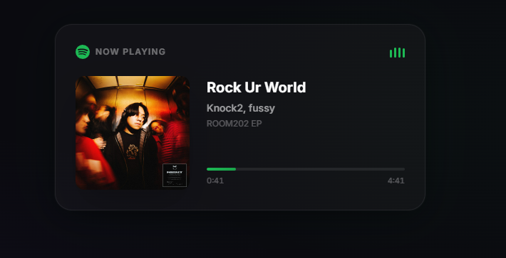

# Spotify Now Playing Widget

A clean, minimalist "Now Playing" widget for your Spotify account, built with Next.js 16 and Tailwind 4. 



## Core Features

- **Real-time Updates**: Automatically polls the Spotify API to show your current track, progress, and playback state.
- **Automated OAuth Flow**: Includes a custom script to handle the initial Spotify authorization and refresh token retrieval.

## Setup Guide

### 1. Spotify Developer Dashboard
- Go to the [Spotify Developer Dashboard](https://developer.spotify.com/dashboard).
- Create a new App.
- In the App settings, add the following as a **Redirect URI**:
  `http://127.0.0.1:3001/callback`

### 2. Environment Variables
Create a `.env.local` file in the root directory and add your credentials:

```bash
SPOTIFY_CLIENT_ID=your_client_id
SPOTIFY_CLIENT_SECRET=your_client_secret
```

### 3. Get Your Refresh Token
I've includeded a helper script to automate the OAuth flow. Run it and follow the instructions in your browser:

```bash
node scripts/get-refresh-token.mjs
```

Once successful, the script will output a `SPOTIFY_REFRESH_TOKEN`. Add it to your `.env.local`:

```bash
SPOTIFY_REFRESH_TOKEN=your_refresh_token
```

### 4. Development
Install dependencies and start the server:

```bash
npm install
npm run dev
```

The widget will be available at `http://localhost:3000`.

## Technical Implementation

- **Data Fetching**: Uses a server-side fetch in `lib/spotify.ts` with token refreshing logic.
- **Polling**: The `NowPlaying` component uses a custom `useEffect` hook to fetch data every few seconds while the tab is active.
- **Animations**: The equaliser bars and progress bar are handled via native CSS transitions for maximum performance.

## License
MIT
